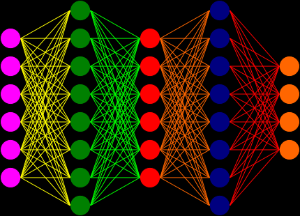

# Neural Network
This is a repo that contains vaious code on neural network that I learned and testd . [For Mom!]

### System
- Ubuntu 18.04 LTS
- GPU : NVIDIA RTX 3070
- RAM : 32 GBS
- NVIDIA Driver : 520.61.05
- CUDA Version : 11.8
- CUDA Capability : 8.6 (86)
- Libtorch Library Version : Stable 1.8.2 ABI - libtorch-cxx11-abi-shared-with-deps-1.8.2+cu111
- CUDA library : cuda-repo-ubuntu1804-11-8-local_11.8.0-520.61.05-1_amd64
- CUDNN library : cudnn-linux-x86_64-8.6.0.163_cuda11-archive

### References [List](REFERENCE.md)
Some of the code is taken from some of other repo (all right belong to their respective author). There are detail of the package, read more in the references list link above.